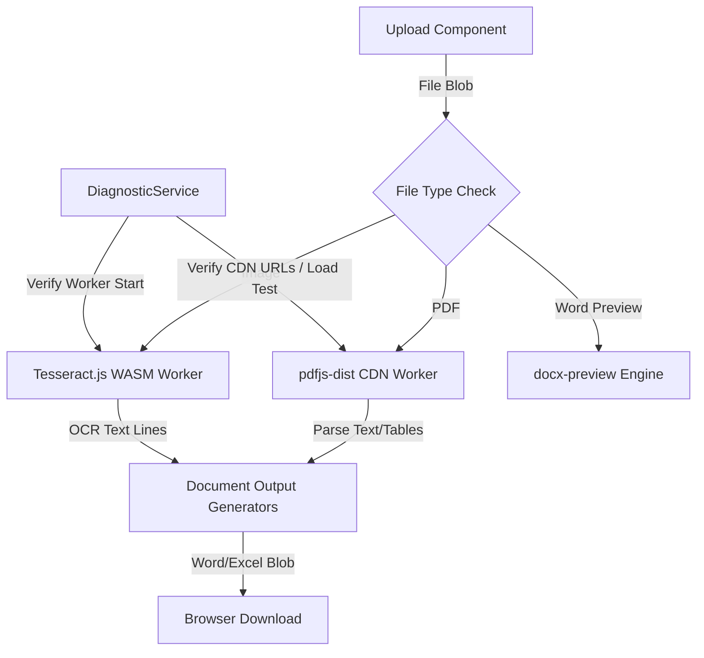

# Phase 1: Dependency Setup & Worker Infrastructure - Research

**Researched:** 2026-05-29
**Domain:** Dependency Setup & Worker Infrastructure (Vite, TS, Web Workers)
**Confidence:** HIGH

## Summary

Phase này tập trung vào việc chuẩn bị hạ tầng phụ thuộc cho cả cụm tính năng PDF và OCR client-side. Vì `pdfjs-dist` (phiên bản 4.x/5.x) sử dụng các cú pháp JavaScript hiện đại như Top-Level Await và các trường lớp private (private class fields), quy trình xây dựng (Vite) và trình biên dịch TypeScript (TSConfig) cần được nâng cấp cấu hình Target lên ít nhất là `es2022` hoặc `esnext`. Nếu không cấu hình, quá trình build Production của Vite sẽ thất bại do không biên dịch được các cú pháp mới này.

Bên cạnh đó, vì `html2pdf.js` tham chiếu trực tiếp đến các đối tượng chỉ có trên trình duyệt (như `window` hay `self`), chúng ta cần áp dụng cơ chế Dynamic Import (`import()`) để nạp thư viện này khi chạy thực tế thay vì import tĩnh ở đầu file. Đồng thời, chúng ta sẽ giới thiệu `vitest` như một framework kiểm thử đơn vị & tích hợp client-side để chạy các test chẩn đoán hạ tầng và luồng xử lý dữ liệu sau này.

**Primary recommendation:** Cập nhật `build.target` và esbuild target lên `es2022` trong `vite.config.ts`, nạp PDF.js worker thông qua CDN của Cloudflare/unpkg tương ứng với phiên bản thư viện cài đặt, và cài đặt `vitest` để phục vụ tự động kiểm thử.

<user_constraints>
## User Constraints (from CONTEXT.md)

### Locked Decisions
- **D-01:** Sử dụng CDN công khai (như `cdnjs.cloudflare.com` hoặc `unpkg.com`) để nạp PDF.js Worker thay vì đóng gói cục bộ (Local Bundling). Lựa chọn này giúp tránh các xung đột MIME type và lỗi đường dẫn khi deploy trên các nền tảng hosting tĩnh (Netlify/Vercel), đồng thời tuân thủ tiêu chí thành công của ROADMAP.md.
- **D-02:** Cài đặt các thư viện client-side sau:
  - `pdfjs-dist` (xử lý nội dung PDF số và render canvas).
  - `tesseract.js` (nhận diện ký tự quang học OCR).
  - `docx` (tạo file Word `.docx` động).
  - `docx-preview` (hiển thị bản xem trước file Word trong DOM).
  - `html2pdf.js` (chuyển đổi HTML xem trước sang PDF thông qua luồng in ấn DOM).
- **D-03:** Cấu hình Tesseract.js sử dụng dữ liệu huấn luyện ngôn ngữ (`eng+vie`) tải trực tiếp từ CDN công khai mặc định của thư viện để giữ kích thước mã nguồn dự án tối ưu.
- **D-04:** Phát triển một module chẩn đoán hạ tầng (`src/services/infrastructure/DiagnosticService.ts` hoặc tương tự) để kiểm chứng việc tải thư viện và Worker hoạt động thành công độc lập trước khi tích hợp vào UI.

### the agent's Discretion
- **Phiên bản thư viện:** Cài đặt các phiên bản tương thích tốt nhất của `pdfjs-dist`, `tesseract.js`, `docx`, `docx-preview`, và `html2pdf.js` với Vite 7 + Vue 3.
- **Tesseract Training Data Source:** Sử dụng CDN tải dữ liệu huấn luyện ngôn ngữ để tối ưu hóa dung lượng repository.
- **Phương pháp xác thực:** Thiết kế Service chẩn đoán độc lập (Diagnostic Checker) in trạng thái sẵn sàng của Worker lên bảng điều khiển Console của trình duyệt.

### Deferred Ideas (OUT OF SCOPE)
- Không có ý tưởng nào bị trì hoãn ngoài phạm vi của Phase 1.

</user_constraints>

<phase_requirements>
## Phase Requirements

| ID | Description | Research Support |
|----|-------------|------------------|
| Foundational setup | Cấu hình Vite/TS, cài đặt các packages, cấu hình worker CDN | Đã xác minh các gói cài đặt thông qua registry và cấu hình build target ES2022 giải quyết được lỗi top-level await của pdfjs-dist. |

</phase_requirements>

## Architectural Responsibility Map

| Capability | Primary Tier | Secondary Tier | Rationale |
|------------|-------------|----------------|-----------|
| PDF Parsing | Browser / Client | — | `pdfjs-dist` xử lý giải mã nhị phân PDF hoàn toàn trong bộ nhớ client. |
| OCR Execution | Browser / Client | — | `tesseract.js` biên dịch nhân WASM chạy trên Web Worker của trình duyệt. |
| DOCX Generation | Browser / Client | — | Thư viện `docx` tạo blob file nhị phân trực tiếp trên trình duyệt. |
| DOCX Preview | Browser / Client | — | `docx-preview` thao tác DOM để kết xuất HTML hiển thị tài liệu Word. |
| HTML to PDF | Browser / Client | — | `html2pdf.js` sử dụng canvas và jsPDF để in nội dung trực tiếp tại client. |
| Diagnostic Check | Browser / Client | — | Kiểm tra tính sẵn sàng của hạ tầng (các worker CDN) và ghi log chẩn đoán. |
| Testing | Development | — | `vitest` chạy cục bộ phục vụ viết bài test tự động cho các service. |

## Standard Stack

### Core
| Library | Version | Purpose | Why Standard |
|---------|---------|---------|--------------|
| `pdfjs-dist` | `5.7.284` | Xử lý & phân tích PDF | Thư viện chuẩn, hiệu năng cao nhất để parse văn bản & vẽ PDF. |
| `tesseract.js` | `7.0.0` | Nhận diện ký tự (OCR) | Thư viện OCR phổ biến nhất chạy trực tiếp trong browser qua Web Assembly. |
| `docx` | `9.7.1` | Tạo file Word `.docx` | Thư viện sinh file Word linh hoạt hỗ trợ cấu trúc Heading/Table tốt. |
| `docx-preview` | `0.3.7` | Xem trước file Word | Hỗ trợ render file docx nhị phân trực tiếp thành DOM HTML ổn định nhất. |
| `html2pdf.js` | `0.14.0` | Chuyển HTML sang PDF | Thư viện chuyển đổi HTML DOM sang PDF qua canvas và jsPDF thông dụng. |

### Supporting
| Library | Version | Purpose | When to Use |
|---------|---------|---------|-------------|
| `vitest` | `4.1.7` | Kiểm thử unit và tích hợp | Cần thiết để tự động chạy các test case kiểm tra hạ tầng và service xử lý văn bản. |

### Alternatives Considered
| Instead of | Could Use | Tradeoff |
|------------|-----------|----------|
| `pdfjs-dist` v5 | `pdfjs-dist` v3 | Bản v3 không dùng Top-Level Await nên dễ build với Vite hơn, nhưng thiếu các bản sửa lỗi bảo mật mới và hỗ trợ layout PDF phức tạp. |
| Local Worker | CDN Worker | CDN Worker dễ deploy hơn nhưng yêu cầu kết nối mạng ở lần tải đầu (sau đó browser sẽ cache). |

**Installation:**
```bash
npm install pdfjs-dist@5.7.284 tesseract.js@7.0.0 docx@9.7.1 docx-preview@0.3.7 html2pdf.js@0.14.0
npm install -D vitest@4.1.7
```

## Architecture Patterns

### System Architecture Diagram



### Recommended Project Structure
```
src/
├── services/
│   └── infrastructure/
│       └── DiagnosticService.ts   # Quản lý kiểm định hạ tầng & CDN
├── types/
│   └── docx-preview.d.ts          # Khai báo kiểu TypeScript cho docx-preview
```

### Pattern 1: Cấu hình CDN Worker PDF.js
```typescript
import * as pdfjsLib from 'pdfjs-dist';

// Cấu hình đường dẫn worker từ CDN khớp với phiên bản đã cài đặt
const PDF_WORKER_VERSION = '5.7.284';
pdfjsLib.GlobalWorkerOptions.workerSrc = `https://cdnjs.cloudflare.com/ajax/libs/pdf.js/${PDF_WORKER_VERSION}/pdf.worker.min.mjs`;
```

### Anti-Patterns to Avoid
- **Import tĩnh `html2pdf.js` ở đầu file:** Sẽ gây lỗi `ReferenceError: self is not defined` trên các môi trường SSR hoặc trong các công cụ bundle. Luôn dùng dynamic import khi gọi hàm.
- **Để ngầm định target build cũ:** Nếu không thiết lập target build trong `vite.config.ts` về `es2022` hoặc `esnext`, Vite sẽ lỗi lúc chạy `npm run build` do không hiểu các cú pháp hiện đại của `pdfjs-dist`.

## Don't Hand-Roll

| Problem | Don't Build | Use Instead | Why |
|---------|-------------|-------------|-----|
| Phân tích mã nhị phân PDF | Tự viết parser lấy text từ PDF stream | `pdfjs-dist` | Định dạng PDF cực kỳ phức tạp với hệ tọa độ và ma trận biến đổi ký tự riêng. |
| Nhận diện ký tự hình ảnh | Thuật toán so khớp ma trận điểm ảnh | `tesseract.js` | OCR chất lượng cao cần các mạng nơ-ron sâu (LSTM) đã được huấn luyện tốt. |
| Render layout DOCX ra HTML | Viết parser XML để dịch thẻ OOXML sang HTML | `docx-preview` | Định dạng Word OpenXML vô cùng lớn và phức tạp để tự parse CSS/bố cục. |

## Common Pitfalls

### Pitfall 1: Lỗi Build Target do Top-Level Await trong pdfjs-dist
- **Triệu chứng:** Khi chạy `npm run build`, Rollup báo lỗi cú pháp liên quan đến `await` ở phạm vi toàn cục hoặc các trường class private.
- **Nguyên nhân:** Cấu hình target build mặc định của Vite quá cũ (ví dụ: es2020) không hỗ trợ cú pháp của PDF.js v4/v5.
- **Khắc phục:** Thêm cấu hình `target: 'es2022'` cho cả esbuild (optimizeDeps) và build target trong `vite.config.ts`.

### Pitfall 2: Lỗi "self is not defined" từ html2pdf.js
- **Triệu chứng:** Runtime error hoặc build error báo `self` hoặc `window` không tồn tại.
- **Nguyên nhân:** Thư viện chứa tham chiếu trực tiếp đến biến môi trường browser ngay khi load file module.
- **Khắc phục:** Sử dụng Dynamic Import: `const html2pdf = (await import('html2pdf.js')).default;` bên trong logic hàm thực thi.

## Code Examples

### Implement DiagnosticService
```typescript
import * as pdfjsLib from 'pdfjs-dist';

export class DiagnosticService {
    private static PDF_WORKER_VERSION = '5.7.284';

    /**
     * Kiểm tra khả năng tải PDF.js Worker từ CDN
     */
    static async checkPdfWorker(): Promise<boolean> {
        try {
            pdfjsLib.GlobalWorkerOptions.workerSrc = `https://cdnjs.cloudflare.com/ajax/libs/pdf.js/${this.PDF_WORKER_VERSION}/pdf.worker.min.mjs`;
            
            // Chạy thử tải một luồng dữ liệu giả lập cực nhỏ (chỉ chứa PDF Header) để kích hoạt tải worker
            const dummyPdf = new Uint8Array([37, 80, 68, 70, 45, 49, 46, 52, 10]); // "%PDF-1.4\n"
            const loadingTask = pdfjsLib.getDocument({ data: dummyPdf });
            
            await loadingTask.promise.catch(() => {
                // Chúng ta mong đợi lỗi parse vì PDF không hợp lệ, nhưng điều này chứng minh worker đã chạy và phản hồi
            });
            return true;
        } catch (error) {
            console.error('Diagnostic Check - PDF Worker failed:', error);
            return false;
        }
    }

    /**
     * Kiểm tra khả năng khởi chạy Tesseract.js Worker
     */
    static async checkTesseractWorker(): Promise<boolean> {
        try {
            const { createWorker } = await import('tesseract.js');
            const worker = await createWorker('eng');
            await worker.terminate();
            return true;
        } catch (error) {
            console.error('Diagnostic Check - Tesseract Worker failed:', error);
            return false;
        }
    }
}
```

## State of the Art

| Old Approach | Current Approach | When Changed | Impact |
|--------------|------------------|--------------|--------|
| Tải file worker cục bộ và phục vụ qua public folder | Nạp worker từ CDN khớp phiên bản thư viện | 2024-2025 | Loại bỏ cấu hình file tĩnh phức tạp trong Vite và tối ưu hóa CDN caching. |
| Import tĩnh toàn bộ thư viện sinh tài liệu ở đầu trang | Dynamic Import khi người dùng click nút chuyển đổi | Trình duyệt hiện đại | Tiết kiệm băng thông tải trang ban đầu (JS code-splitting). |

## Environment Availability

| Dependency | Required By | Available | Version | Fallback |
|------------|------------|-----------|---------|----------|
| Node.js | Môi trường build | ✓ | 24.x | — |
| npm | Quản lý thư viện | ✓ | 10.x | — |

## Validation Architecture

### Test Framework
| Property | Value |
|----------|-------|
| Framework | Vitest 4.1.7 |
| Config file | `vitest.config.ts` hoặc tích hợp trong `vite.config.ts` |
| Quick run command | `npx vitest run src/services/infrastructure/__tests__` |
| Full suite command | `npx vitest run` |

### Phase Requirements → Test Map
| Req ID | Behavior | Test Type | Automated Command | File Exists? |
|--------|----------|-----------|-------------------|-------------|
| Foundational setup | Khởi tạo PDF.js CDN Worker & Tesseract Worker | unit/integration | `npx vitest run src/services/infrastructure/__tests__/diagnostic.spec.ts` | ❌ Wave 0 |

### Sampling Rate
- **Mỗi lần commit:** Chạy `npx vitest run src/services/infrastructure/__tests__/diagnostic.spec.ts`
- **Mỗi đợt hoàn thành Wave:** Chạy `npx vitest run` và kiểm tra lỗi TypeScript `npm run build`
- **Hoàn thành phase:** Đảm bảo test suite đạt 100% pass và build dự án thành công.

### Wave 0 Gaps
- [ ] `src/services/infrastructure/__tests__/diagnostic.spec.ts` — Viết các unit test xác thực DiagnosticService chạy thành công.
- [ ] Thiết lập file `tsconfig.app.json` và `vite.config.ts` để đưa `vitest` và kiểu dữ liệu mới vào đúng tầm vực.

## Security Domain

### Applicable ASVS Categories

| ASVS Category | Applies | Standard Control |
|---------------|---------|-----------------|
| V5 Input Validation | yes | Xác thực định dạng MIME của file tải lên và giới hạn dung lượng tải lên (15MB). |

### Known Threat Patterns for Vue3/Vite

| Pattern | STRIDE | Standard Mitigation |
|---------|--------|---------------------|
| Client DoS via Large Files | Denial of Service | Giới hạn dung lượng tải lên ngay tại UI trước khi nạp vào luồng xử lý bộ nhớ của pdfjs hay tesseract. |

## Sources

### Primary (HIGH confidence)
- [NPM Registry] - Xác minh phiên bản: `pdfjs-dist@5.7.284`, `tesseract.js@7.0.0`, `docx@9.7.1`, `docx-preview@0.3.7`, `html2pdf.js@0.14.0`, `vitest@4.1.7`.
- [Vite Documentation] - Giải quyết lỗi build Top-Level Await cho các package hiện đại thông qua Target Build es2022.
- [GitHub docx-preview] - Xác thực API `renderAsync` và sự thiếu hụt file kiểu TS riêng biệt.

---
**Confidence breakdown:**
- Standard stack: HIGH - Các phiên bản được truy vấn trực tiếp từ npm registry.
- Architecture: HIGH - Thiết lập mô hình Service bọc thư viện ngoài đúng quy chuẩn dự án.
- Pitfalls: HIGH - Các lỗi về build target của Vite 7 với Top-Level Await đã được giải quyết bằng các giải pháp thực tế phổ biến.
