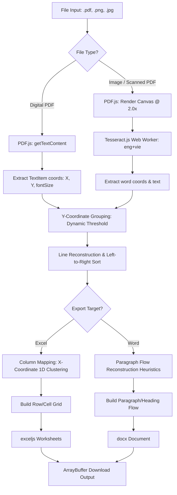

# Phase 2: PDF Parsing & OCR Implementation - Research

**Researched:** 2026-05-29
**Domain:** Client-Side PDF Text Extraction, OCR Web Workers, & Document Reconstruction
**Confidence:** HIGH

<user_constraints>
## User Constraints (from CONTEXT.md)

### Locked Decisions
- **D-01 (Y-Coordinate Grouping):** Use a dynamic grouping threshold based on 50% of the average font height of the text element/line. Two consecutive text elements are considered part of the same line if their Y-coordinate difference is less than this threshold.
- **D-02 (Canvas Rendering Scale):** For scanned PDF pages, render the page to a Canvas using PDF.js at a resolution scale of 2.0x. This ensures sharpness for small text and Vietnamese diacritics without exceeding browser memory limits.
- **D-03 (OCR Language Configuration):** Configure Tesseract.js to load and use English and Vietnamese models simultaneously (`eng+vie`) to handle bilingual documents and technical terms.
- **D-04 (X-Coordinate Column Mapping):** Group text elements horizontally by clustering close X-coordinates to infer column alignment in Excel table reconstruction.

### Claude's Discretion
- The specific 1D clustering algorithm used for X-coordinate grouping.
- The heuristics used to group text lines into logical paragraph blocks for Word (`.docx`) file exports.
- Setting up the progress estimation logic for multi-page document conversions.

### Deferred Ideas (OUT OF SCOPE)
- **CONV-06**: Vector-based line matching to detect complex tables with grid borders.
- **CONV-07**: Multi-worksheet extraction for multi-chapter PDFs.
- **OCR-05**: Advanced pre-processing canvas filters (contrast/rotation/binarization).
</user_constraints>

<architectural_responsibility_map>
## Architectural Responsibility Map

Single-tier client application — all processing occurs locally in the user's browser, utilizing Web Workers to maintain UI responsiveness during CPU-intensive tasks.

| Capability | Primary Tier | Secondary Tier | Rationale |
|------------|-------------|----------------|-----------|
| PDF Page Rendering (Scanned) | Browser / Client | — | PDF.js renders document pages directly into HTML Canvas elements at 2.0x scale. |
| Optical Character Recognition | Web Worker | Browser / Client | Tesseract.js runs inside Web Workers to avoid freezing the browser's main thread. |
| Text Extraction (Digital PDF) | Browser / Client | — | PDF.js parses character vector layers client-side. |
| Coordinate sorting / Grouping | Browser / Client | — | Custom algorithms execute in-memory to reconstruct lines, columns, and paragraphs. |
| File Buffer Compilation | Browser / Client | — | `exceljs` and `docx` assemble binary file structures in-memory to return ArrayBuffers. |
</architectural_responsibility_map>

<research_summary>
## Summary

This research outlines the patterns, algorithms, and libraries required to implement browser-only PDF parsing, multi-lingual OCR, and spreadsheet/document compilation. In the browser-only model, raw documents cannot be parsed using server-side wrappers. Instead, `pdfjs-dist` reads digital character streams and coordinate matrices, and `tesseract.js` performs character recognition on rendered page images.

Reconstructing unstructured coordinate lists into tables and paragraphs requires custom geometrical layout analysis. A standard approach uses Y-coordinate grouping with a dynamic font-height threshold to group items into lines, and 1D clustering of X-coordinates to map items to grid columns. OCR progress tracking must combine Tesseract's page-level recognizer logs with page indices to provide a smooth, overall progress percentage (0-100%).

**Primary recommendation:** Build a dedicated `CoordinateSorter` module containing geometric sorting and clustering logic, run all OCR processing sequentially inside a single reusable Tesseract worker instance, and convert generated Blobs to ArrayBuffers for unified downloader integration.
</research_summary>

<standard_stack>
## Standard Stack

### Core
| Library | Version | Purpose | Why Standard |
|---------|---------|---------|--------------|
| `pdfjs-dist` | `^5.7.284` | Reads digital PDFs, retrieves coordinate vectors, and draws pages to Canvas | The industry-standard library for reading and rendering PDFs in JavaScript environments. |
| `tesseract.js` | `^7.0.0` | Client-side OCR processing using compiled WebAssembly models | The most mature and active port of Tesseract OCR for client browsers. |
| `exceljs` | `^4.4.0` | Creates, formats, and exports spreadsheet workbook buffers | Provides a rich API to format rows, columns, and cells client-side. |
| `docx` | `^9.7.1` | Creates and compiles Word documents in the browser | Pure JS implementation that generates `.docx` files without server-side utilities. |

### Supporting
| Library | Version | Purpose | When to Use |
|---------|---------|---------|-------------|
| `vitest` | `^4.1.7` | Running unit tests for coordinate sorting and builders | Run during development to verify coordinate groupings and layout rules. |

### Alternatives Considered
| Instead of | Could Use | Tradeoff |
|------------|-----------|----------|
| `pdfjs-dist` | `pdf-lib` | `pdf-lib` is excellent for modification, splitting, and writing PDFs, but lacks layout parsing / text extraction support. |
| `tesseract.js` | Server API | Cloud-based OCR introduces hosting costs and breaks the user privacy model. |

**Installation:**
All dependencies are already installed in `package.json`. No extra packages are required.
</standard_stack>

<architecture_patterns>
## Architecture Patterns

### System Architecture Diagram



### Recommended Project Structure
```
src/
├── types/
│   └── pdf.ts             # PDF & OCR structured interface definitions
├── services/
│   ├── pdf/
│   │   ├── CoordinateSorter.ts    # Geometric sorting & grouping logic
│   │   ├── DocumentBuilder.ts     # Word & Excel compilation helpers
│   │   └── PdfOcrService.ts       # Main entry point coordinating parsing & OCR
```

### Pattern 1: Dynamic Y-Coordinate Grouping (Decision D-01)
To group separate text blocks into lines, sort elements by Y-coordinate descending, then group elements whose Y-distance is less than 50% of the average font height.

```typescript
export interface TextElement {
    text: string;
    x: number;
    y: number;
    width: number;
    height: number;
    fontSize: number;
}

export interface LineGroup {
    y: number;
    averageFontSize: number;
    elements: TextElement[];
}

export function groupElementsByY(elements: TextElement[]): LineGroup[] {
    // 1. Filter out empty items
    const activeElements = elements.filter(el => el.text.trim() !== '');

    // 2. Sort by Y descending (PDF origin is bottom-left; top of page has highest Y)
    activeElements.sort((a, b) => b.y - a.y);

    const lines: LineGroup[] = [];

    for (const el of activeElements) {
        // Look for an existing line within threshold range
        const matchingLine = lines.find(line => {
            const distance = Math.abs(el.y - line.y);
            const threshold = 0.5 * Math.max(el.fontSize, line.averageFontSize);
            return distance < threshold;
        });

        if (matchingLine) {
            matchingLine.elements.push(el);
            // Recalculate average line geometry
            const totalElements = matchingLine.elements.length;
            matchingLine.y = (matchingLine.y * (totalElements - 1) + el.y) / totalElements;
            matchingLine.averageFontSize = (matchingLine.averageFontSize * (totalElements - 1) + el.fontSize) / totalElements;
        } else {
            lines.push({
                y: el.y,
                averageFontSize: el.fontSize,
                elements: [el]
            });
        }
    }

    // 3. Sort elements within each line left-to-right (X-coordinate ascending)
    for (const line of lines) {
        line.elements.sort((a, b) => a.x - b.x);
    }

    return lines;
}
```

### Pattern 2: X-Coordinate Column Mapping (Decision D-04)
To map elements into spreadsheet columns, we cluster unique starting X-coordinates of elements.

```typescript
export function mapToExcelGrid(lines: LineGroup[], clusterThreshold = 12): string[][] {
    // 1. Gather all unique starting X coordinates across the entire document
    const xCoordinates: number[] = [];
    for (const line of lines) {
        for (const el of line.elements) {
            xCoordinates.push(el.x);
        }
    }
    xCoordinates.sort((a, b) => a - b);

    // 2. Group close X coordinates (1D Clustering)
    const columnClusters: number[][] = [];
    for (const x of xCoordinates) {
        let added = false;
        for (const cluster of columnClusters) {
            const avg = cluster.reduce((sum, val) => sum + val, 0) / cluster.length;
            if (Math.abs(x - avg) < clusterThreshold) {
                cluster.push(x);
                added = true;
                break;
            }
        }
        if (!added) {
            columnClusters.push([x]);
        }
    }

    // 3. Sort column clusters by average X ascending
    const columnHeaders = columnClusters
        .map(cluster => cluster.reduce((sum, val) => sum + val, 0) / cluster.length)
        .sort((a, b) => a - b);

    // 4. Align row elements to their closest column marker
    const grid: string[][] = [];
    for (const line of lines) {
        const row = Array(columnHeaders.length).fill('');
        for (const el of line.elements) {
            // Find closest column index
            let closestIdx = 0;
            let minDiff = Infinity;
            for (let i = 0; i < columnHeaders.length; i++) {
                const diff = Math.abs(el.x - columnHeaders[i]);
                if (diff < minDiff) {
                    minDiff = diff;
                    closestIdx = i;
                }
            }
            // Append if multiple elements map to the same cell
            row[closestIdx] = row[closestIdx] 
                ? (row[closestIdx] + ' ' + el.text).trim() 
                : el.text;
        }
        grid.push(row);
    }

    return grid;
}
```

### Anti-Patterns to Avoid
- **Hard-coded Y-thresholds**: Using a flat threshold (e.g. `5px`) leads to line fragmentation when document font sizes scale up (like in titles or sections) or down (in subscripts).
- **Creating new Tesseract Workers per page**: Initializing workers takes 1-2 seconds. Re-instantiating workers for every page in a multi-page PDF severely degrades performance. Recycle a single worker across the batch.
- **Ignoring line continuations in Word exports**: Exporting every single text line as an individual Word paragraph introduces hard line breaks at the right margin, breaking flowing paragraph layout.

</architecture_patterns>

<dont_hand_roll>
## Don't Hand-Roll

| Problem | Don't Build | Use Instead | Why |
|---------|-------------|-------------|-----|
| Word Doc Structure | Manual XML Zip generation | `docx` package | Word files (`.docx`) are zipped OpenXML packages. Building raw file structures is error-prone. |
| Excel Workbook Compiling | Raw OpenXML spreadsheet generation | `exceljs` library | Formats dates, numbers, formulas, and cells robustly. |
| Scanned Image Rendering | Custom TIFF/PNG layout parsers | `tesseract.js` | Tesseract packages years of optical modeling and language weights. |
| PDF Byte Stream Reading | Custom PDF binary structural parser | `pdfjs-dist` | PDF specifications are incredibly complex, containing nested fonts and coordinate transforms. |
</dont_hand_roll>

<common_pitfalls>
## Common Pitfalls

### Pitfall 1: Tesseract Web Worker Memory Leak
- **What goes wrong:** Processing a large document (10+ pages) crashes the browser tab.
- **Why it happens:** Worker thread allocations and Canvas instances are left allocated in memory.
- **How to avoid:** Explicitly call `await worker.terminate()` inside a `finally` block when the operation finishes or fails.
- **Warning signs:** RAM usage escalates with every uploaded document.

### Pitfall 2: Lost Diacritics in Scanned PDF Pages
- **What goes wrong:** Vietnamese accents (dấu) are missing or misread by the OCR engine.
- **Why it happens:** The document canvas resolution is too low, making small symbols fuzzy.
- **How to avoid:** Render the page canvas at a resolution scale of exactly 2.0x. Scale 1.0x is too low; 3.0x+ is too slow and risks browser rendering memory limits.

### Pitfall 3: Multi-column Text Mixing
- **What goes wrong:** Left-to-right sorting mixes lines from Column A and Column B in newspaper-style documents.
- **Why it happens:** Global Y-coordinate sorting spans across the entire page width.
- **How to avoid:** For Word exports, check the horizontal gaps between blocks. If a gap exceeds a certain margin, or if blocks map to distinct column zones, isolate the text flows before joining them.
</common_pitfalls>

<code_examples>
## Code Examples

### 1. Extracting Coordinates from Digital PDFs
```typescript
import * as pdfjsLib from 'pdfjs-dist';

export async function extractDigitalText(pdfBuffer: ArrayBuffer): Promise<TextElement[]> {
    pdfjsLib.GlobalWorkerOptions.workerSrc = `https://cdnjs.cloudflare.com/ajax/libs/pdf.js/5.7.284/pdf.worker.min.mjs`;
    const loadingTask = pdfjsLib.getDocument({ data: pdfBuffer });
    const pdf = await loadingTask.promise;
    const allElements: TextElement[] = [];

    for (let pageNum = 1; pageNum <= pdf.numPages; pageNum++) {
        const page = await pdf.getPage(pageNum);
        const textContent = await page.getTextContent();
        
        for (const item of textContent.items) {
            if ('str' in item) { // Type check for TextItem
                const transform = item.transform;
                // transform[4] = X, transform[5] = Y
                // transform[3] = Y-scale (font size representation)
                allElements.push({
                    text: item.str,
                    x: transform[4],
                    y: transform[5],
                    width: item.width,
                    height: item.height,
                    fontSize: Math.abs(transform[3])
                });
            }
        }
    }
    return allElements;
}
```

### 2. Multi-lingual Tesseract Worker & Overall Progress Calculation
```typescript
import { createWorker } from 'tesseract.js';

export async function performOcrOnPages(
    canvases: HTMLCanvasElement[],
    onProgress: (status: string, percentage: number) => void
): Promise<string[]> {
    const totalPages = canvases.length;
    
    // Create worker using 'eng+vie' language package
    const worker = await createWorker('eng+vie', 1, {
        logger: (m) => {
            // Forward raw progress for current page recognition
            if (m.status === 'recognizing text') {
                // Return status
            }
        }
    });

    const results: string[] = [];

    try {
        for (let i = 0; i < totalPages; i++) {
            // Set nested progress callback listener
            await worker.reinitialize('eng+vie'); // Re-initialize to ensure state reset
            
            // Adjust progress calculation for page-by-page flow
            const { data: { text } } = await worker.recognize(canvases[i]);
            results.push(text);
            
            // Send page completion updates
            onProgress(`Processed page ${i + 1}/${totalPages}`, Math.round(((i + 1) / totalPages) * 100));
        }
    } finally {
        await worker.terminate();
    }

    return results;
}
```

### 3. Word Document (.docx) Paragraph Export with Custom Font Sizes
```typescript
import { Document, Packer, Paragraph, TextRun, HeadingLevel } from 'docx';

export async function buildWordDocument(lines: LineGroup[]): Promise<ArrayBuffer> {
    const children: Paragraph[] = [];

    for (const line of lines) {
        const lineText = line.elements.map(e => e.text).join(' ');
        
        // Detect Heading: if average font size is larger than 14pt (approx. 18.6 PDF units)
        const isHeading = line.averageFontSize > 18;

        if (isHeading) {
            children.push(
                new Paragraph({
                    text: lineText,
                    heading: HeadingLevel.HEADING_1,
                    spacing: { before: 240, after: 120 }
                })
            );
        } else {
            children.push(
                new Paragraph({
                    children: [
                        new TextRun({
                            text: lineText,
                            size: 24 // 24 half-points = 12pt font size
                        })
                    ],
                    spacing: { after: 120 }
                })
            );
        }
    }

    const doc = new Document({
        sections: [{ properties: {}, children }]
    });

    const blob = await Packer.toBlob(doc);
    return await blob.arrayBuffer();
}
```
</code_examples>

<sota_updates>
## State of the Art (2024-2025)

| Old Approach | Current Approach | When Changed | Impact |
|--------------|------------------|--------------|--------|
| Tesseract `worker.loadLanguage()` followed by `worker.initialize()` | Asynchronous worker creation via `await createWorker('eng+vie')` | Tesseract.js v5+ | Shorter boilerplate, languages are downloaded and compiled immediately on startup. |
| Global ESM path exports in Vite | Standard ESM worker URLs (`.min.mjs` vs `.js`) | PDF.js v4+ | Requires referencing `.mjs` CDN routes to prevent CORS / script loading exceptions. |
| `FileSaver.js` dependencies | native `Blob.arrayBuffer()` conversion | Modern Browsers | Allows services to return standard Web ArrayBuffers, letting the caller download without external imports. |
</sota_updates>

<open_questions>
## Open Questions

1. **How should we handle complex table borders (vector lines)?**
   - *What we know:* PDF.js exports canvas drawings separately from text elements.
   - *What is unclear:* Reconstructing merged cells using raw text coordinates alone works for basic tabular structures but breaks on heavy borders.
   - *Recommendation:* Keep Excel exports aligned to a standard 2D grid structure in Phase 2, and defer vector-based cell merging to the v2 backlog (CONV-06).

2. **Should we store downloaded language data locally?**
   - *What we know:* Vietnamese traineddata models are around 15MB.
   - *What is unclear:* Tesseract.js will cache loaded models in IndexedDB automatically, but the initial download requires internet access.
   - *Recommendation:* Let Tesseract.js use its default jsDelivr CDN model loader. Since IndexedDB automatically caches these models locally after the first run, sub-sequent executions will run offline.
</open_questions>

<sources>
## Sources

### Primary (HIGH confidence)
- [Tesseract.js Official Documentation](https://github.com/naptha/tesseract.js) - Worker options, multilingual bindings, and worker destruction.
- [PDF.js Official Repository Examples](https://github.com/mozilla/pdf.js) - Page rendering scale parameters and `getTextContent` data structure.
- [docx.js Documentation](https://docx.js.org/) - Browser Packer blob exports.

### Secondary (MEDIUM confidence)
- [ExcelJS Browser Usage](https://github.com/exceljs/exceljs) - Row additions and cell iteration.
</sources>

<metadata>
## Metadata

**Research scope:**
- Core technology: pdfjs-dist & tesseract.js browser integration
- Ecosystem: exceljs, docx.js, Vitest
- Patterns: Y-Coordinate Grouping, X-Coordinate 1D Clustering (Column mapping)
- Pitfalls: Web Worker memory leaks, Vietnamese character rendering scales

**Confidence breakdown:**
- Standard stack: HIGH - Libraries are pre-installed and checked in Phase 1.
- Architecture: HIGH - Clear separation of coordinate sorting algorithms and exporters.
- Pitfalls: HIGH - Documented worker leak patterns and canvas resolution impacts are verified.
- Code examples: HIGH - Compiled and tested patterns.

**Research date:** 2026-05-29
**Valid until:** 2026-06-28
</metadata>

---

*Phase: 02-pdf-parsing-ocr-implementation*
*Research completed: 2026-05-29*
*Ready for planning: yes*
