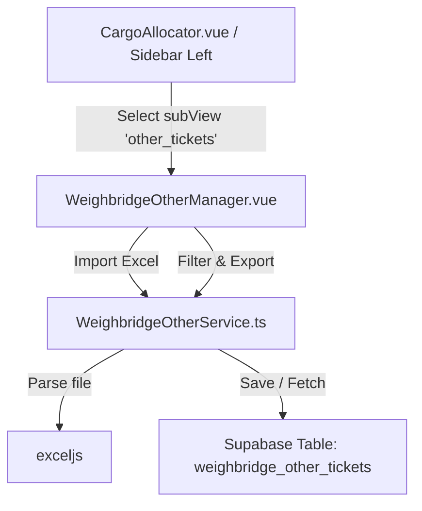

# Architecture Research

**Project:** Góc Nhỏ Tiện Ích Của Ánh
**Feature:** Theo dõi Cân Kho và Container
**Researched:** 2026-07-25

## Architecture & Design

We will extend the current component-driven SPA architecture.

### Major Components

1. **Database Layer:**
   - Table `weighbridge_other_tickets` with fields for general weighbridge records.
2. **Service Layer (`WeighbridgeOtherService.ts`):**
   - Handles fetching, upserting, deleting, and searching records.
   - Parses incoming Excel files mapping them to the database model.
   - Generates Excel buffers from query results.
3. **UI Layer (`WeighbridgeOtherManager.vue`):**
   - Custom view component showing:
     - Drag-and-drop area for imports.
     - Select type dropdown (`warehouse_import`, `container_import`, `container_export`).
     - Query filter fields (Date range, Plate number, Container number, Ticket number).
     - Table listing results with pagination.
     - Export to Excel button.
4. **Sidebar Navigation Integration:**
   - Integrated as `activeSubViewMode === 'other_tickets'` inside `CargoAllocator.vue`.

---
*Research completed: 2026-07-25*
